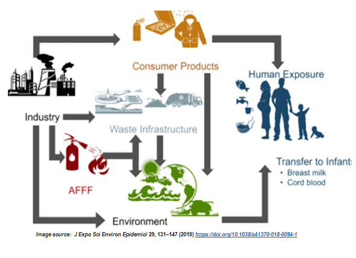

# PFAS Analysis in partnership with MassDEP

    </img>

The Massachusetts Department of Environmental Protection (MassDEP) is responsible for ensuring clean air and water, safe management and recycling of solid and hazardous wastes and pertinent activities. MassDEP is currently working to address contamination in Massachusetts drinking water supplies due to the presence of Per- and polyfluoroalkyl substances (PFAS). PFAS are a group of chemicals which have been commonly used in manufacturing, consumer goods, firefighting foam, and a variety of other industrial uses. PFAS can easily leach into the environment following the spillage or disposal of PFAS containing products. Numerous studies have indicated that PFAS exposure would cause a variety of harmful health effects to humans. Although PFAS is widely present in the environment, the primary method of significant and hazardous PFAS exposure for humans is from the consumption of drinking water from contaminated sources. PFAS-contaminated water sources are typically found in areas where hazardous materials that contain regulated PFAS compounds have been used or disposed of, such as at manufacturing facilities, landfills, airports, or firefighting locations. MassDEP has established a drinking water standard for PFAS to limit the level of PFAS in public drinking water supplies. This standard identifies six PFAS compounds (PFAS6) as posing toxicity risks when more than 20 nanograms per liter (20 ng/L) (individually, or in total sum). There is no existing MA state requirement for PFAS testing of private wells. The focus of this project concerns the risk of hazardous PFAS releases and the potential PFAS exposure risk to nearby private drinking water wells. 

#### Models/Analysis
- Lab Report Data Extraction
    - Aims to unlock data from disparate, unconfirmed PDF to make it actionable for research and analysis in an automated fashion
- Release Risk Model
    - Aims to predict the risk of a hazardous PFAS chemical releases in an area of the state so that MassDEP could proactively focus on the area of higher risks
- Well Exposure Risk Model 
    - Aims to predict the risk of PFAS exposure to a private well in an area assuming a release in the area has occurred assisting MassDEP to prioritize testing of wells that have higher likelihood of getting PFAS. 
- Source Attribution Analysis 
    - Aims to identify likely contamination sources responsible for PFAS release at disposal sites, based on the signature profile of detected PFAS compounds to inform methods of prevention.  
#### Repository structure
~~~
├───art
├───data
    ├───disposal_sites
    ├───Extracted lab report data
    ├───features
    ├───modeling_data
    │   ├───release_risk
    │   ├───source_attribution
    │   │   ├───attribution modeling
    │   │   └───profiling
    │   └───well_exposure
    │       └───base_samples
    ├───private_wells
    └───residential
├───scripts
    ├───gis_feature_engineering
    ├───imputation
    │   ├───extracted_data
    │   ├───private_well
    ├───Lab report extraction
    ├───Release Risk Model
    ├───source_attribution_analysis
    │   ├───pfas18
    │   ├───pfas6
    └───Well Exposure Model
~~~

#### Acknowledgements
This work is done in partnership with the MassDEP and WPI DS GQP.  
Authors: Adam DiChiara, Dan Cher, Marwan Alsaedi, Karthik Deiveegarajan and Scott Tang  
Special Thanks to Matthew Fitzpatrick for all his tireless work in making this project possible.

  
   

